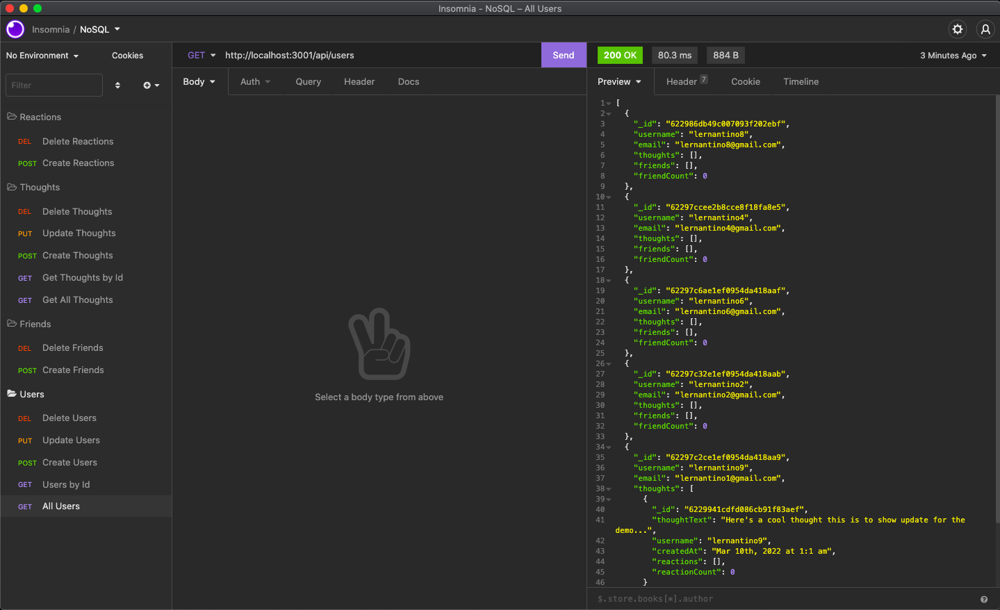

# challenge-18-NoSQL

### In this challenge, we are running a command line interface using MongoDB

### We are using insomnia to display the addtions of new users, new thoughts within the user object and reactions to the thoughts array

### Moving away from SQL we are successfully able to create an API to load data that isnt structed the way that we are used to seeing

### We use the GET, POST, PUT and DELETE methods to modify our databse

### This challenge we are introduced to different methods and commands to activate and manipualte the database

Github Repo: https://github.com/fayazl/challenge-18-NoSQL
Heroku Link